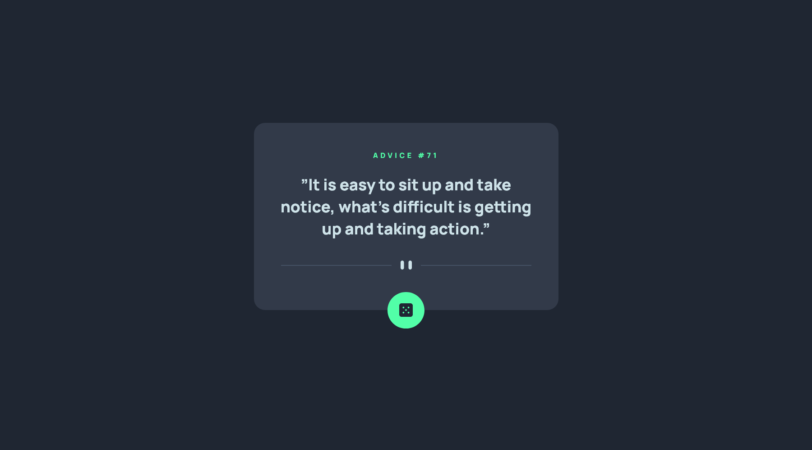
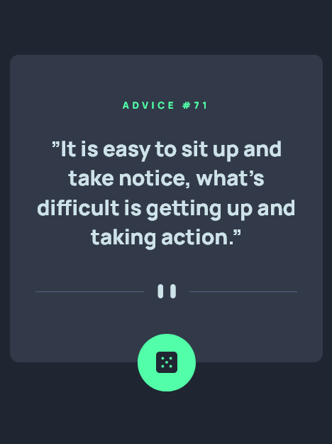

# Frontend Mentor - Advice generator app solution

This is a solution to the [Advice generator app challenge on Frontend Mentor](https://www.frontendmentor.io/challenges/advice-generator-app-QdUG-13db). Frontend Mentor challenges help you improve your coding skills by building realistic projects.

## Table of contents

- [Overview](#overview)
  - [The challenge](#the-challenge)
  - [Screenshot](#screenshot)
  - [Links](#links)
- [My process](#my-process)
  - [Built with](#built-with)
  - [Useful resources](#useful-resources)
- [Author](#author)

## Overview

### The challenge

Users should be able to:

- View the optimal layout for the app depending on their device's screen size
- See hover states for all interactive elements on the page
- Generate a new piece of advice by clicking the dice icon

### Screenshot

### Links

- Solution URL: [https://github.com/coderwww/Mentor-Advice-generator-app](https://github.com/coderwww/Mentor-Advice-generator-app)
- Live Site URL: [https://coderwww.github.io/Mentor-Advice-generator-app](https://coderwww.github.io/Mentor-Advice-generator-app)

## My process

### Built with

- Semantic HTML5 markup
- SCSS
- Flexbox
- Mobile-first workflow
- Vanilla JS

### Useful resources

- [Disable Blue Highlight when Touch/Press object with Cursor:Pointer](https://stackoverflow.com/questions/25704650/disable-blue-highlight-when-touch-press-object-with-cursorpointer) - This helped me. I really liked this pattern and will use it going forward.
- [How to Use Fetch with async/await](https://dmitripavlutin.com/javascript-fetch-async-await/) - This is an amazing article. I'd recommend it to anyone still learning this concept.
- [Referrer and cache control APIs for fetch()](https://hacks.mozilla.org/2016/03/referrer-and-cache-control-apis-for-fetch/) - This is an amazing article. I'd recommend it to anyone still learning this concept.

## Author

- Website - [https://coderwww.github.io](https://coderwww.github.io)
- Frontend Mentor - [@coderwww](https://www.frontendmentor.io/profile/coderwww)

